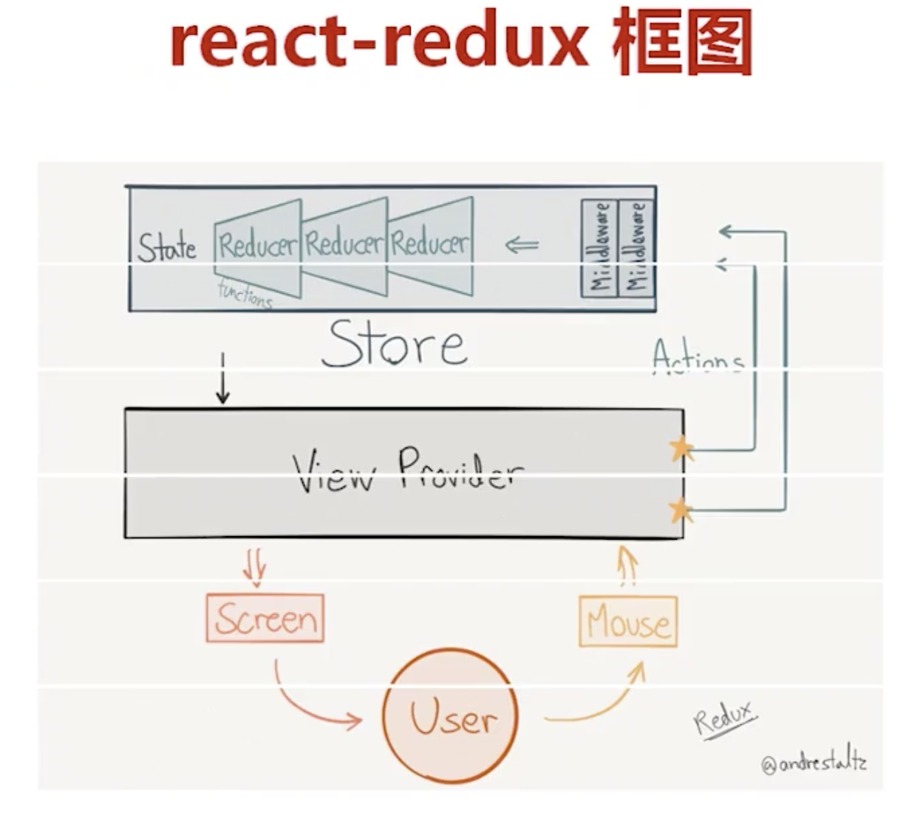

## react-redux 示例

#### redux主要知识点

* action 描述多种状态state，行为动作，但不操作
* reducer 针对状态state对行为进行操作,返回新的state
* store Redux 应用只有一个单一的store,维持应用的 state

#### redux数据流

#### 启动项目

* npm install
* npm start

